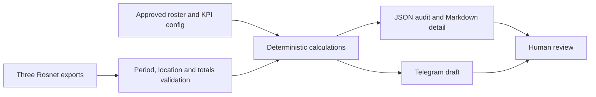

# Restaurant Server KPI Reporting

An AI-assisted operations project that turns three monthly Rosnet exports into validated employee KPI scores and a Telegram-ready summary. The public configuration contains fictional employees. Real restaurant exports, employee information and generated operational reports stay outside Git.

## Problem and result

Restaurant managers need to combine beverage sales, employee sales statistics and table-turn times with shift-specific targets and exclusions. This project makes those definitions explicit, reconciles source totals and calculates monthly weighted PPA instead of averaging employee averages.

The score uses beverages (40%), discounts (25%), account time (20%) and PPA (15%). Net sales identifies top sellers independently and does not add points to the KPI ranking. Reports require human review before publication.

## Current status

- Implemented: configurable monthly calculation, Rosnet XLSX ingestion, full-month and restaurant validation, total reconciliation, duplicate and missing-data checks, previous-month comparison, JSON audit output, Markdown detail and Spanish Telegram draft.
- Implemented in the local working project: formula-driven Excel workbook, print setup and visual verification. The initial Excel exporter uses the bundled Codex Artifact Tool; it is not yet a portable unattended exporter in this public CLI.
- Scheduling: an app-managed task in the private operational chat is active for the first Monday–Friday of each month at 09:00 America/Chicago. Files are attached to that chat manually. The scheduler is separate from this repository and has not yet completed its first monthly scheduled run.
- Pending: portable unattended Excel export integration.
- No Rosnet login automation, Telegram sending or model API calls are enabled by this repository.

## Run locally

Python 3.10 or newer:

```sh
python -m pip install -r requirements.txt
python -m unittest discover -s tests -v
python -m examples.demo
```

Copy `config.example.json` to `private/config.local.json`. Replace the fictional roster with the approved current roster, restaurant ID and exclusions. Put the three unmodified XLSX exports in a dedicated monthly directory:

```text
inputs/2026-09/
  BRGIHOP Employee Contest Detail ... .xlsx
  Employee Sales Statistics ... .xlsx
  Server Table Turn Stats ... .xlsx
```

```sh
python src/server_report.py --month 2026-09 --input inputs/2026-09 --config private/config.local.json --previous-input inputs/2026-08 --output outputs
```

Without prior-month files, omit `--previous-input`. The command writes `outputs/2026-09/report.json`, `report.md`, and `telegram.txt`. Rerunning replaces those three outputs after successful validation. Employees missing from the entire prior month do not receive fabricated comparison scores. A newly appearing beverage employee missing from roster/exclusions stops processing for review.

## Architecture



See [methodology](docs/methodology.md), [monthly runbook](docs/monthly-runbook.md), [portfolio case study](docs/portfolio-case-study.md) and a [fictional sample report](examples/demo_report.md).

## AI collaboration

AI assisted source inspection, implementation, documentation and workbook layout. The project owner defined eligibility, AM/PM targets, exclusions, the time objective and weighted PPA policy. Runtime scores use explicit formulas, not model-generated numbers. Source reconciliation, independent result comparison and formula checks provide evidence of correctness.

## Public data policy

Commit only application code, synthetic tests, example configuration and documentation. `.gitignore` excludes XLSX files, operational inputs/outputs, private configuration and original session scripts. Inspect the exact staged files before publishing. This project is a portfolio demonstration, not an official Rosnet or IHOP product. No time savings, revenue improvements or job-market outcomes have been measured or claimed.
